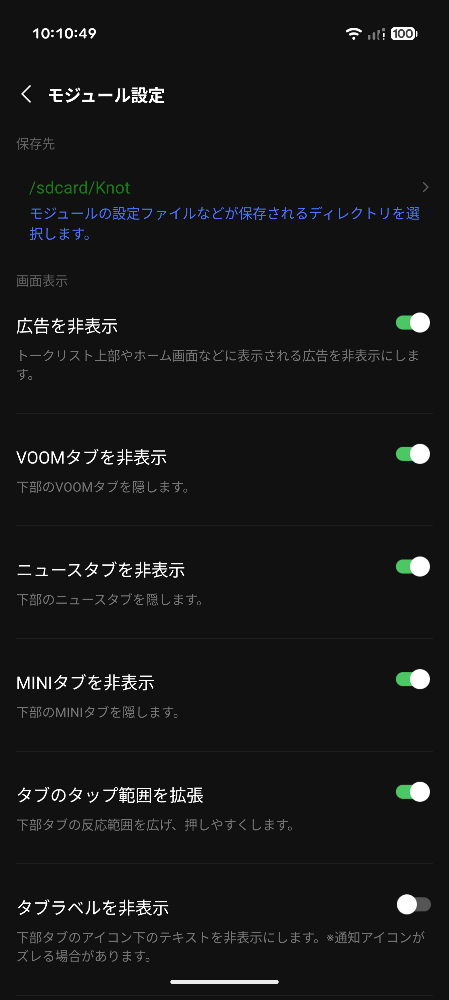
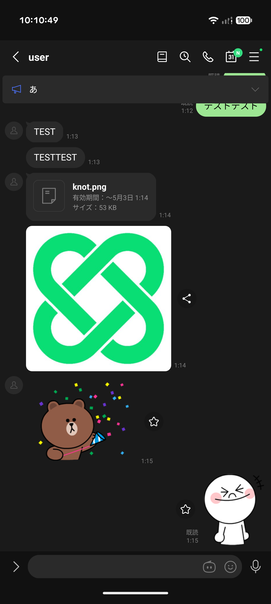
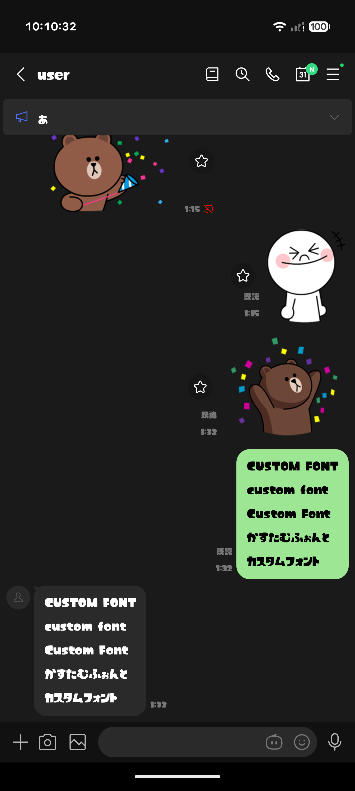
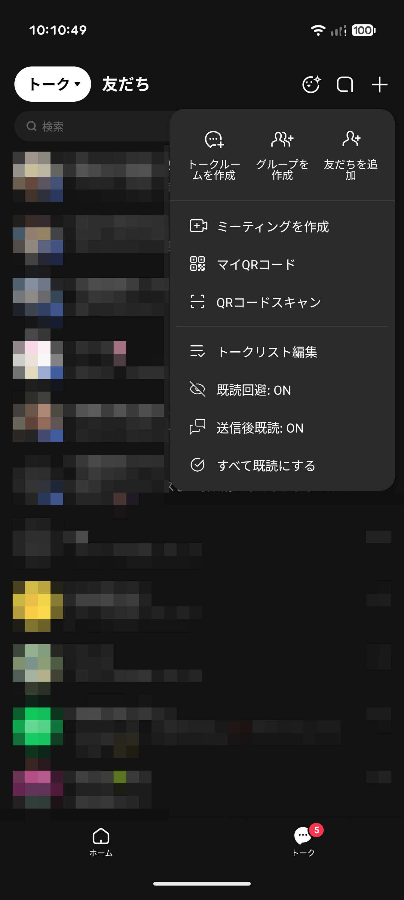
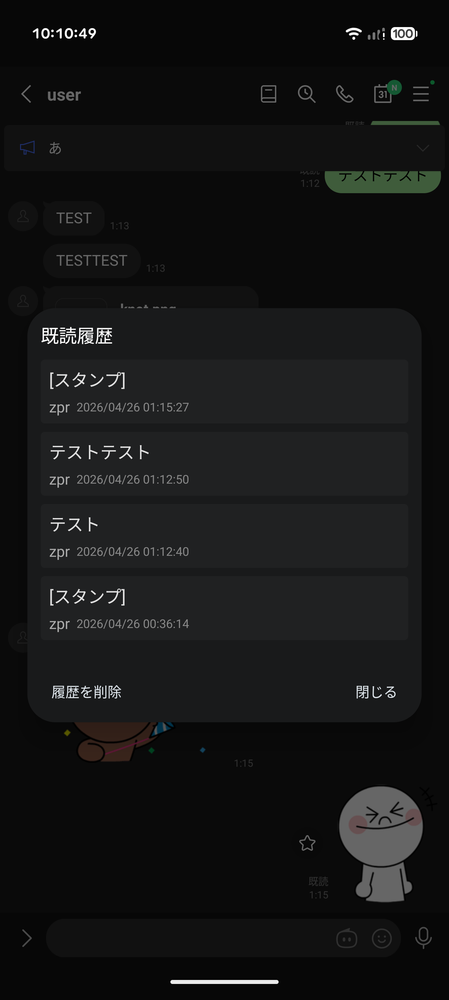
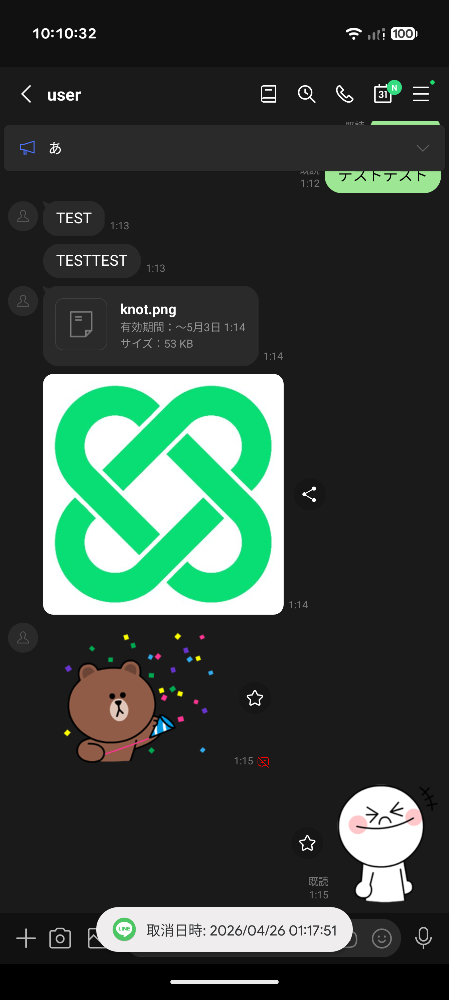

  <h1>
    
    Knot
  </h1>
  
A brand-new Xposed module for LINE

---

**Knot** は、Android版LINEのユーザー体験を向上させるために設計された開発中のXposedモジュールです。

> ⚠️このモジュールは個人が学習目的で開発したものであり、使用は自己責任で行ってください。LINEの利用規約に抵触する可能性があり、このモジュールを使用したことによる不利益について、開発者は一切の責任を負いません。

## スクリーンショット

| 設定画面 | チャット画面 | カスタムフォント |
| :---: | :---: | :---: |
|  |  |  |

| プラスメニュー | 既読履歴 | 送信取り消し防止 |
| :---: | :---: | :---: |
|  |  |  |

## 主な機能

### プライバシー & メッセージ
- **既読回避**: メッセージを既読にせずに読み、返信したい時だけ既読にできます。
- **送信取り消し無効化**: 相手が取り消したメッセージを自分の端末に残します。
- **既読履歴の記録**: 誰がいつメッセージを読んだかを詳細に記録します。
- **送信取り消しの制限延長**: 送信取り消しが可能な時間を24時間まで延長します。

### ディスプレイ & UI
- **広告非表示**: トークリストやホーム画面の広告を排除します。
- **タブのカスタマイズ**: VOOM、ニュース、MINIなどの不要なタブを非表示にできます。
- **タブラベル非表示**: アイコン下のテキストを消してスッキリとしたレイアウトにします。
- **カスタムフォント**: お好みのTTF/OTFフォントファイルをアプリ全体に適用できます。
- **ホームのおすすめ非表示**: ホーム画面の不要なコンテンツを隠します。

### その他
- **着せかえ無料化**: ショップの着せかえをすべて無料でダウンロード・適用可能にします。
- **スタンプお試し無制限**: スタンプのお試し利用回数の制限を解除します。
- **ブラウザ切り替え**: アプリ内ブラウザではなく、システムのデフォルトブラウザでURLを開きます。

## 使い方

1. [Vector](https://github.com/JingMatrix/Vector) または互換性のあるXposed環境をインストールします。
2. [Knot APK](https://github.com/2b-zipper/Knot/releases/latest)をインストールし、Vectorマネージャーでモジュールを有効化します。
3. 対象アプリとして **LINE** を選択します。
4. LINEを再起動し、Knotのモジュール設定から各機能を有効化してください。モジュール設定は、ホームタブ右上の設定ボタンを長押しするか、LINE設定内の追加項目からアクセスできます。

> 非rootユーザーは [NPatch](https://github.com/7723mod/NPatch) の利用を推奨します。

## ライセンス

このプロジェクトは [GNU GPLv3](LICENSE) の下で公開されています。
